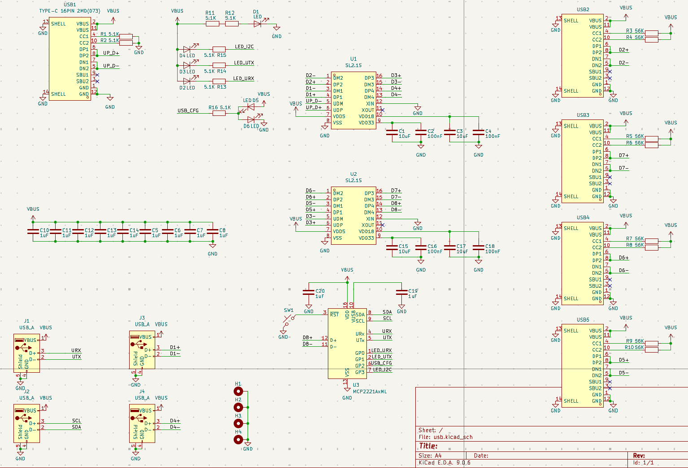
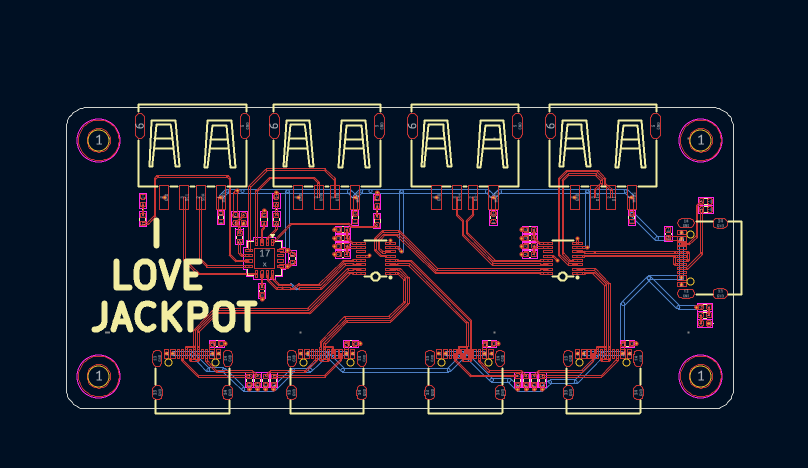
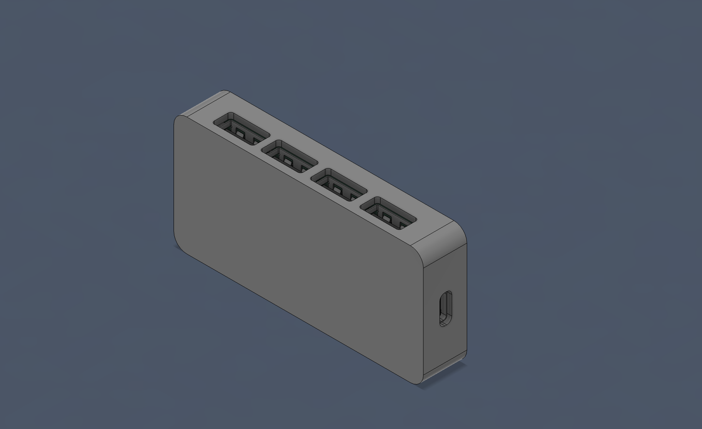
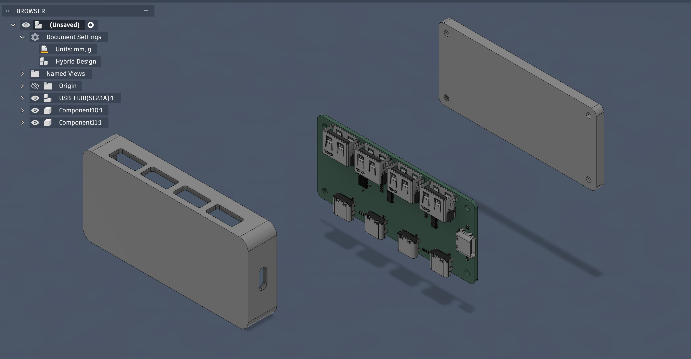

# Usb_Hub
A usb hub based out of SL2.1 IC

The board features 1 USB Type-C upstream port and 8 downstream ports with 4 Type-A and 4 Type-C ports, Two of the Type-A ports act as a UART-to-USB and I2C-to-USB bridge.

To use this USB Hub, simply plug the USB-C port that's on the right side to your host device. This USB Hub requires no firmware or drivers and should work by default on all operating systems.

## SCHEMATICS

## PCB

## CAD DESIGN

